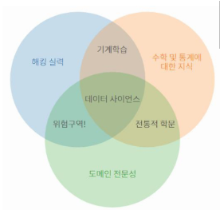
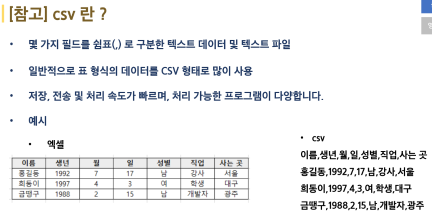
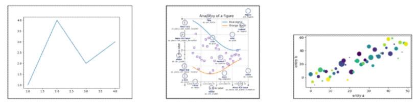

# 데이터 사이언스
- 다양한 데이터로부터 새로운 지식과 정보를 추출하기 위해 과학적 방법론, 프로세스, 알고리즘, 시스템을 동원하는 융합 분야  
- 컴퓨터 과학, 통계학, 수학 등 다양한 학문의 원리와 기술을 활용  

  
## 데이터 사이언스 프로세스  
1. 문제정의: 해결하고자 하는 문제 정의  
2. 데이터 수집: 문제 해결에 필요한 데이터 수집  
3. 데이터 전처리(정제): 실질적인 분석을 수행하기 위해 데이터를 가공하는 단계로 수집한 데이터의 오류 제거(결측치, 이상치), 데이터 형식 변환 등  
4. 데이터 분석: 전처리가 완료된 데이터에서 필요한 정보를 추출하는 단계  
5. 결과 해석 및 공유: 의사 결정에 활용하기 위해 결과를 해석하고 시각화 후 공유하는 단계  
  
## 프로세스 1. 문제 정의  
- 실습에서 해결하고자 하는 문제는 다음과 같습니다.  
- 구글의 주식 가격은 앞으로 어덯게 될까?  
  
## 프로세스 2. 데이터 수집  
- 주식 가격을 분석하기 위해서는 기간 별 주식 가격에 대한 데이터가 필요합니다.  
- 데이터 수진은 다양한 기술과 방법을 활용할 수 있습니다. (웹스크래핑, 웹 크롤링, Open API 활용, 데이터 공유 플랫폼 활용)  
- 캐글(Kaggle): 데이터 분석 경진대회 플랫폼, 기업 및 단체에서 데이터와 해결 과제를 등록하면 데이터 과학자들이 이를 해결하는 방법을 개발하고 경쟁할 수 있는 플랫폼, 경진대회. 데이터셋 공유.토론 등의 기능이 가능  
  
## 프로세스 3. 데이터 전처리(정제)  
- 데이터 전처리 단계를 분석을 진행하기 전 데이터를 정제하는 단계입니다.  
- 불완전하거나 오류가 있는 데이터를 제거하여 데이터의 품질을 개선하고 중복 데이터를 제거하며 분석하기 적절한 형식으로 데이터를 변화  
- 데이터 전처리 및 분석에 사용되는 파이썬 패키지: Numpy, Pandas, Matplotlib  
  
  
# CSV란?  
- 몇 가지 필드를 쉼표로 구분한 텍스트 데이터 및 텍스트 파일  
- 일반적으로 표 형식의 데이터를 CSV 형태로 많이 사용  
- 저장, 전송 및 처리 속도가 빠르며, 처리 가능한 프로그램이 다양하다  
  
  
# Numpy  
1. 다차원 배열을 쉽게 처리하고 효율적으로 사용할 수 있도록 지원하는 파이썬 패키지  
2. 장점  
- Numpy 행렬 연산은 데이터가 많을수록 Python 반복문에 비해 훨씬 빠르다.  
- 다차원 행렬 자료 구조를 제공하여 개발하기 편하다.  
3. 특징  
- CPython(공식 사이트의 Python)에서만 사용 가능  
- 행렬 인덱싱(Array Indexing) 기능 제공  
  
# Pandas  
1. Numpy의 한계  
- 유연성(데이터에 레이블을 붙이거나, 누락된 데이터로 작업)이 부족함  
- 그룹화, 피벗 등 구조화가 부족함  
2. Pandas는 마치 프로그래밍 버전의 엑셀을 다루듯 고성능의 데이터 구조를 만들 수 있음  
3. Numpy 기반으로 만들어진 패키지로, Series(1차원 배열) 과 DataFrame(2차원 배열)이라는 효율적인 자료구조 제공  
  
# Matplotlib  
1. Python에서 데이터 시각화를 위해 가장 널리 사용되는 라이브러리  
2. 다양한 종류의 그래프와 도표를 생성하고 데이터를 시각적으로 표현할 수 있다.  



# 실습  

1.   
- 첫번째 문제
```
# CSV 파일 경로
csv_path = 'NFLX.csv'

# CSV 파일 읽어오기
df = pd.read_csv(csv_path)

# 'Date' 열의 데이터를 datetime 타입으로 변환
df['Date'] = pd.to_datetime(df['Date'])

# 2021년 이후의 데이터만 필터링
df_2021 = df[df['Date'] >= '2021-01-01'].copy()  #.copy()를 안 쓸 경우 A value is trying to be set on a copy of a slice from a DataFrame.

# # DataFrame 출력
# df_2021

# 연도와 월을 추출
df_2021['Year'] = df_2021['Date'].dt.year
df_2021['Month'] = df_2021['Date'].dt.month

# 월 별로 그룹화 
monthly_grouped = df_2021.groupby([df_2021['Date'].dt.month])
```

지금 2021년 2022년이 두개가 있으므로 이렇게 그룹화하면 2021년 1월과 2022년 1월이 합쳐진다.  
  
- 이를 해결하기 위한 방법  
[월 별 그룹화](https://www.askpython.com/python-modules/pandas/groupby-to-group-dataframe-by-month)  
```
# CSV 파일 경로
csv_path = 'NFLX.csv'

# CSV 파일 읽어오기
df = pd.read_csv(csv_path)

# 'Date' 열의 데이터를 datetime 타입으로 변환
df['Date'] = pd.to_datetime(df['Date'])

# 2021년 이후의 데이터만 필터링
df_2021 = df[df['Date'] >= '2021-01-01'].copy()  #.copy()를 안 쓸 경우 A value is trying to be set on a copy of a slice from a DataFrame.

# # DataFrame 출력
# df_2021

# 연도와 월을 추출
df_2021['Year'] = df_2021['Date'].dt.year
df_2021['Month'] = df_2021['Date'].dt.month

# 월 별로 그룹화
monthly_grouped = df_2021.groupby(['Year', 'Month'])
```  
  
2.  
```
# 월 별로 평균 종가를 계산
avg_close_monthly = monthly_grouped['Close'].mean().reset_index()
# 모든 월에 2021붙이기: https://www.geeksforgeeks.org/how-to-reset-index-after-groupby-pandas/
```  
.reset_index()를 안붙이면 인덱싱이 1월에만 붙는다.  
  
3.  
데이터에 새롭게 Date를 만들려고  
```
# 년도, 월 붙이기
avg_close_monthly['Date'] = pd.to_datetime(avg_close_monthly['Year'].astype('str') + "-" + avg_close_monthly['Month'].astype('str'))
#년 월 붙이는 방법: https://www.skytowner.com/explore/combining_columns_of_years_months_and_days_in_pandas
```  
했으나 에러가 나서 plot할 때 년-월을 만들기 위해  
```
# 그래프 그리기 (가로, 세로 축에 표시될 데이터를 차례로 기입)
plt.plot(avg_close_monthly['Year'].astype('str') + "-" + avg_close_monthly['Month'].astype('str'), avg_close_monthly['Close'])
```