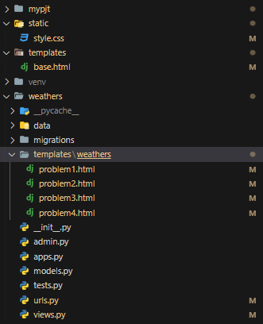

# 관통형 프로젝트 by 채은, 지현(PJT)

## 프로젝트
Django에서 Data Science 활용하기

## 목표
1. 데이터 사이언스 패키지를 Django 에서 활용하는 방법 익히기

## 사용한 개발도구
- Visual Studio Code
- Google Chrome
- Python 3.9 +
- Django 4.2 +
- Pandas
- Matplotlib

## 제공사항
1. problem1
- URL: /weathers/problem1/ 역할: 다운로드 받은 데이터(.csv) 출력  
- VIEW METHOD: problem1 역할: 다운로드 받은 데이터(.csv) 를 Pandas DataFrame 형식으로 저장 및
problem1.html 렌더링
2. problem2
- URL: /weathers/problem2/ 역할: 일 별 온도 비교를 위한 라인 그래프 출력
- VIEW METHOD: problem2 역할: 일 별 온도 비교를 위한 라인 그래프 생성 및 problem2.html 렌더링
3. problem3
- URL: /weathers/problem3/ 역할: 월 별 온도 비교를 위한 라인 그래프 출력  
- VIEW METHOD: problem3 역할: 월 별 온도 비교를 위한 라인 그래프 생성 및 problem3.html 렌더링
4. problem4
- URL: /weathers/problem4/ 역할: 기상 현상 발생 횟수 히스토그램 출력  
- VIEW METHOD: problem4 역할: 기상 현상 발생 횟수 히스토그램 생성 및 problem4.html 렌더링

## 요구사항
### 1. 공통  
1. 캐글을 통해 데이터를 다운로드 받아 활용합니다.  
- 데이터셋: Austin Weather(텍사스 오스틴 날씨 데이터)  
- 데이터셋 요약: 2013-12-21 ~ 2017-07-31 까지의 일 별 날씨 데이터 (크기: 20kB)  
2. Django 프로젝트의 이름은 mypjt, 앱 이름은 weathers 로 지정합니다.  
3. .gitignore 파일을 추가하여 불필요한 파일 및 폴더는 제출하지 않도록 합니다.  
4. 명시된 요구사항 이외에는 자유롭게 작성해도 무관합니다.  
### 2. base.html  
1. 공통 부모 템플릿 
- 모든 템플릿 파일은 base.html 을 상속받아 사용합니다. 
- 다른 파일 템플릿 경로로 이동할 수 있는 링크들을 출력합니다.
2. 출력결과 예시  
  

### 3. problem1.html 
- Pandas 를 사용하여 캐글에서 다운로드 받은 파일을 DataFrame 으로 읽어옵니다.
- 제공된 스타일을 활용하여 전체 데이터를 표 형태로 출력합니다.  
- 출력 결과 예시
 

### 4. problem2.html 
1. 일 별 최고, 평균, 최저 온도를 선 그래프로 출력합니다.  
- 날짜 필드: 날짜 형식으로 변환하여 사용합니다. 
2. 출력 결과 예시  
   

### 5. problem3.html  
1. 월 별 최고, 평균, 최저 온도의 평균을 선 그래프로 시각화 합니다.  
- 날짜 필드: 날짜 형식으로 변환하여 사용합니다.
- 온도 필드: 평균값 계산을 위해 숫자 형식으로 변환하여 사용합니다.  
2. 출력 결과 예시  
 
  
### 5. problem4.html  
1. 기상 현상의 발생 횟수(“Events” 컬럼)를 히스토그램으로 출력합니다.  
- 사용되는 Events 컬럼은 “결측치” 가 포함되어 있으며, “다중 값을 허용” 합니다.
- 다중 값은 각 기상 현상의 발생 횟수에 추가하여 계산합니다.ex) “Rain , Thunderstorm” = “Rain + 1, Thunderstorm + 1” 로 계산합니다.  
2. 출력 결과 예시  
   

## 배운점1  
예전에 html의 head부분에 style을 주절이 주절이 적거나, 태그마다 스타일을 적용하는것은 코드도 깔끔하지 않고 유지보수에도 용이하지 않다고 배웠다.  
이번에 style.css에 style을 적용하기 위해 2023.09.27에 배운 static을 적용하였다.  
코드를 짤 때 단수형과 복수형을 잘못 입력하거나 오타 때문에 오류가 종종 발생해 코드를 짤 때 이를 유의해야겠다고 생각했다.  
-  
-   
-   
-   
  
## 배운점2  
E. problem4.html를 만들며 Pandas의 시리즈(Series)라는 자료구조를 새로 알게 되었다.  
[pandas.Series](https://pandas.pydata.org/docs/reference/api/pandas.Series.html)  
[[파이썬] pandas 자료 구조: Series 기초](https://hogni.tistory.com/43)  
[Series 기초](https://wikidocs.net/4364)  
  
## 배운점3  
B. problem1.html를 만들며 표 내용이 칸 한줄에 모두 보이도록 만들고 싶어 검색과 주변 친구들에게 물어본 결과, 'nowrap'을 쓰면 된다는 것을 새로 알게 되었다.  
[HTML 공식문서](https://html.com/attributes/td-nowrap/)  
[HTML 4-7 셀 내에서의 줄바꿈을 금지하는 nowrap 속성](https://m.blog.naver.com/PostView.naver?isHttpsRedirect=true&blogId=sonicheroes1&logNo=220673261220) 

## 소감
조원과 2인 1조로 내비게이터/드라이버로 나누어 진행하였다. 내비게이터는 키보드를 사용하지 않고
드라이버는 키보드를 잡는 사람으로 역할을 나누었다. 구현하려는 기능을 사전에 토의한 후,
한시간 단위로 내비게이터/드라이버를 교체하였다. 혼자 하는 것보다 둘이 하는 것이 재밌었고 효율이 좋아서 왜 다들 프로젝트를 조를 짜서 진행하는지 이유를 알게 되었다. 재밌었다.