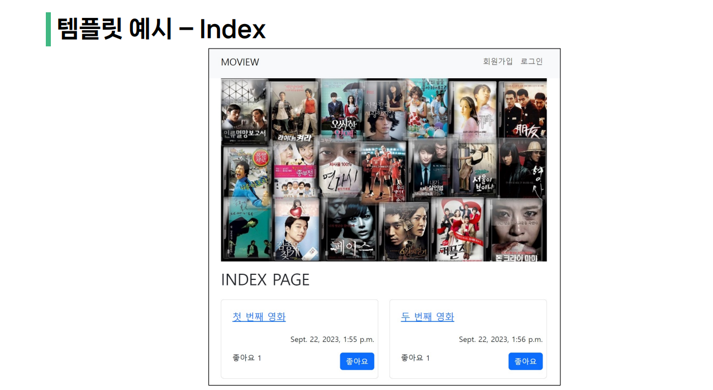
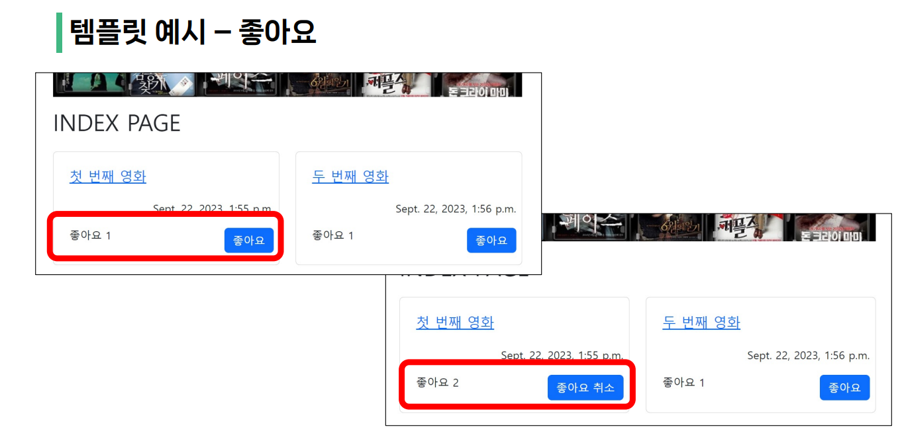
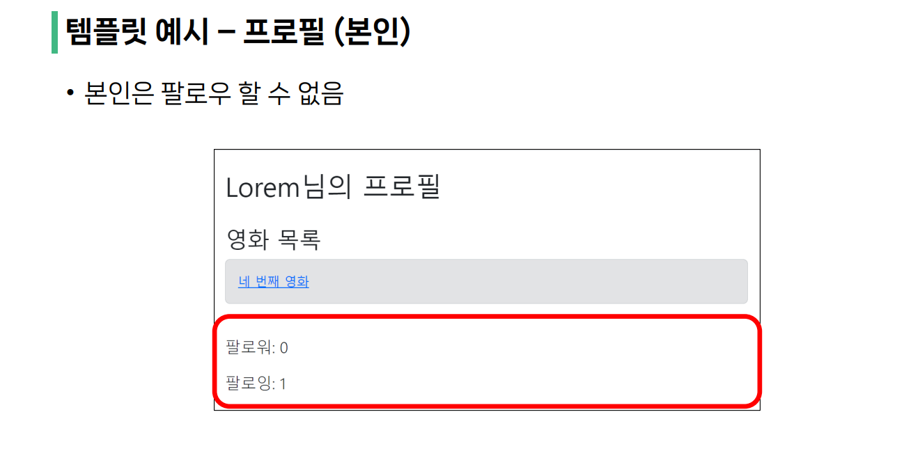
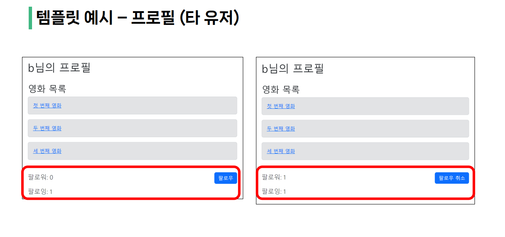
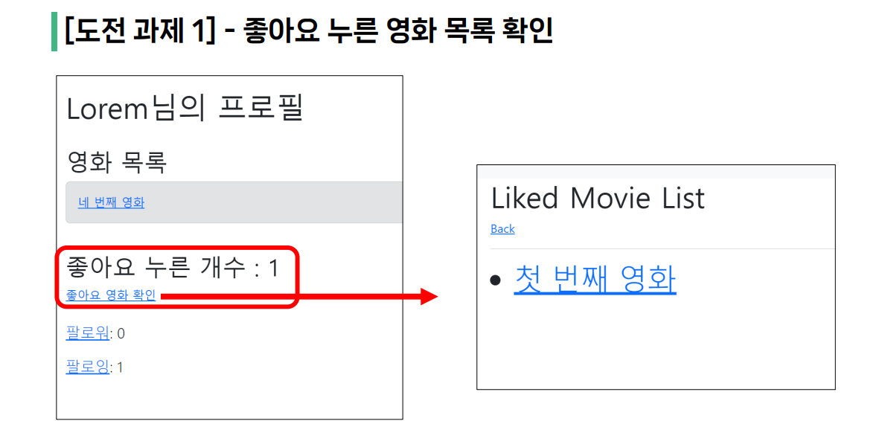
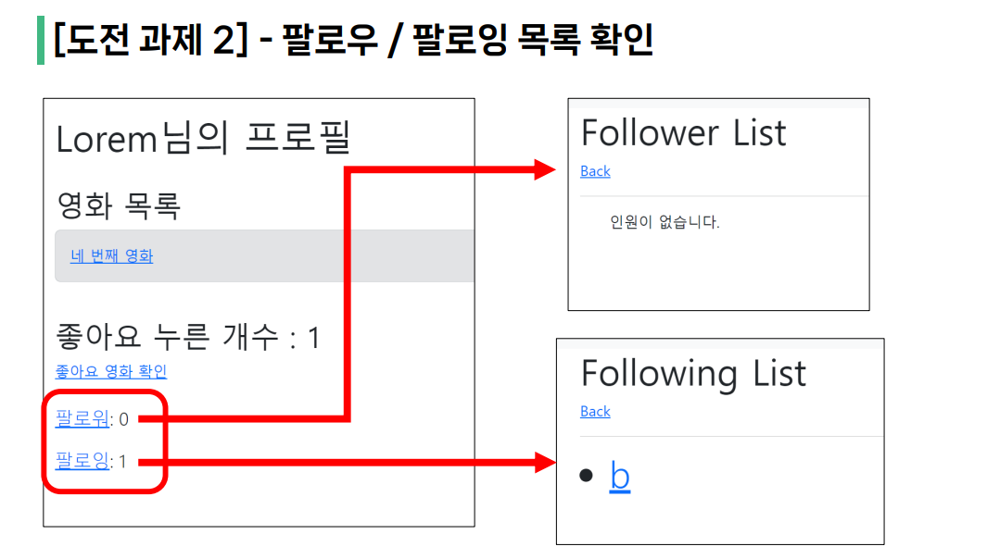
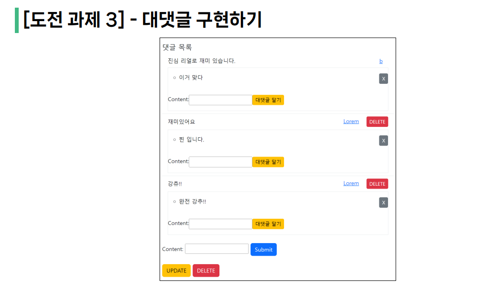

# <예진이와 우당탕탕 쿠르쾅쾅 시끄러운 프로젝트>

## 사전 세팅 (git)

```python
# git 이름과 이메일 변경
git config --global user.name <이름>
git config --global user.email <이름>
```

## 공동작업을 위한 git merge
- MAIN
```python
# 브랜치 생성
git branch <브랜치 이름>

# 브랜치로 이동
git switch <다른 브랜치 이름>

# 변경사항 스테이징(저장이라고 생각)
git add .
git commit -m "<커밋 내용>"

# 변경사항 푸쉬(필수는 아니지만 하면 원격 저장소에 변경사항 반영되고 현재 브랜치의 최신 커밋이 푸시된다.)
git push

# 병합을 시작하기 전에 master 브랜치의 최신 상태를 반영 깃풀
git pull

# 병합을 하려면 master 브랜치로 이동
git switch master

# master 브랜치에 병합 
git merge <브랜치 이름>
```
<br>

- ADDITIONAL
```python
# 브랜치 목록 확인: 어떤 branch가 있나
git branch

# 커밋 히스토리를 요약하여 한 줄로 보기
git log --oneline
# 커밋 히스토리를 그래프로 보기
git log --oneline --all --graph

# 병합된 브랜치만 삭제 가능: 이미 병합이 완료된 상태라면 필요없는 브랜치 이므로 안전하게 삭제
git branch -d <브랜치 이름>
# (!주의) 강제 삭제: 병합 완료 여부는 확인하지 않고 삭제
git branch -D <브랜치 이름>
```
<br>
<br>  

# 06-pjt : 관계형 데이터베이스 설계  

## ROAD MAP

### 프로젝트 목표  
- 데이터를 생성, 조회, 수정, 삭제할 수 있는 Web application 제작  
- Django web framework를 사용한 데이터 처리  
- Django Model과 ORM에 대한 이해  
- Django Authentication System에 대한 이해  
- Database many to one relationship (1:N) 및 many to many relationship (M:N)에 대한 이해  
  
### 준비사항  
- 개발도구  
  - Visual Studio Code  
  - Google Chrome  
  - Django 4.2.x  
  
### 공통 요구사항  
1. 공통 요구사항
- 프로젝트의 이름
  -mypjt  
- 앱 이름  
  - movies  
    - 영화정보 생성, 조회, 수정, 삭제, 좋아요, 댓글 작성, 댓글 조회, 댓글 삭제  
  - accounts  
    - 로그인, 로그아웃, 회원가입, 회원탈퇴, 회원정보 수정, 비밀번호 수정, 팔로우  
  - .gitignore 파일을 추가하여 불필요한 파일 및 폴더는 제출하지 않음  
2. 필수 요구사항 - 모델 클래스  
- Movie 모델 클래스  
  - 영화 제목과 줄거리를 입력할 필드 2개 지정  
  - 작성자 정보를 저장할 필드 1개 지정  
  - 좋아요 한 유저 정보를 저장하는 필드 1개 지정  
- Comment 모델 클래스  
  - 댓글 정보를 입력할 필드 1개 지정  
  - 댓글이 작성 될 영화 정보와 댓글 작성자 정보를 저장할 필드 2개 지정  
- User 모델 클래스  
  - AbstactUser 모델 클래스를 상속받는 커스텀 모델을 사용  
  - 팔로우 유저 정보를 저장하는 필드 1개 지정  
- 생성되는 중계 테이블 안내  
  - A. movies_movie_like_users
    - movie와 user의 id 정보가 저장됨
  - B. accounts_user_followings  
    - follow 관계를 가지는 user 정보가 저장됨  
3. ERD (Entity-Relationship Diagram)  
  
  
4. 필수 요구사항  
- 본인이 작성한 데이터만 수정 및 삭제 가능하도록 구성  
- 로그인 한 사람들만 데이터 생성, 수정, 삭제 할 수 있도록 구성  
- 로그인 한 회원만 댓글을 생성, 삭제할 수 있음  
- 본인이 작성한 댓글에 대해서만 삭제할 수 있음  
- 비밀번호 변경 직후 로그인 상태를 유지해야 함  
5. 필수 요구사항 – view 함수  
- movies 앱의 view 함수  
  - index  
    - 역할
      - 전체 영화 데이터 조회 및 index.html 렌더링  
    - 허용 HTTP Method : GET  
  - create  
    - 역할  
      - create.html 렌더링  
      - 유효성 검증 및 영화 데이터 저장 후 detail 로 리다이렉트
    - 허용 HTTP Method : GET & POST  
  - detail  
    - 역할
      - detail.html 렌더링  
      - 단일 영화 데이터 조회  
      - 단일 영화에 달린 모든 댓글 데이터 조회  
    - 허용 HTTP Method : GET  
  - update  
    - 역할  
      - 수정 대상 영화 데이터 조회 및 update.html 렌더링
      - 본인이 작성한 영하 데이터만 수정 가능
      - 유효성 검증 및 영화 데이터 수정 후 detail 로 리다이렉트  
    - 허용 HTTP Method : GET & POST 
  - delete  
    - 역할  
      - 본인이 작성한 영화 데이터만 삭제 가능  
      - 단일 영화 데이터 삭제 및 index 로 리다이렉트  
    - 허용 HTTP Method : POST
  - comments_create  
    - 역할
      - 유효성 검증 및 댓글 데이터 저장 후 detail 로 리다이렉트
    - 허용 HTTP Method : POST
  - comments_delete
    - 역할
      - 단일 댓글 데이터 삭제 및 detail 로 리다이렉트
      - 본인이 작성한 댓글만 삭제 가능
    - 허용 HTTP Method : POST
  - likes
    - 역할
      - 단일 영화 좋아요 기능 (이미 좋아요 눌린 경우는 좋아요 취소) 
      - 좋아요 기능 동작 후 index 로 리다이렉트
    - 허용 HTTP Method : POST
- accounts 앱의 view 함수  
  - login 
    - 역할
      - login.html 렌더링
      - 로그인 절차 진행 후 index 로 리다이렉트
    - 허용 HTTP Method : GET & POST
  - logout  
    - 역할  
      - DB와 클라이언트의 쿠키에서 인증된 사용자의 세션 데이터 삭제
    - 허용 HTTP Method : POST 
  - signup  
    - 역할
      - signup.html 렌더링  
      - 유효성 검증 및 회원 데이터 저장 후 index 로 리다이렉트  
    - 허용 HTTP Method : GET & POST  
  - update  
    - 역할  
      - 수정 대상 회원 데이터 조회 및 update.html 렌더링
      - 유효성 검증 및 회원 데이터 수정 후 index 로 리다이렉트
    - 허용 HTTP Method : GET & POST 
  - delete  
    - 역할  
      - 단일 회원 데이터 삭제 및 index 로 리다이렉트  
    - 허용 HTTP Method : POST
  - change_password  
    - 역할
      - change_password.html 렌더링
      - 비밀번호 변경 후 index 로 리다이렉트
    - 허용 HTTP Method : GET & POST

  - profile  
    - 역할  
      - profile.html 렌더링  
      - 단일 회원 데이터 및 작성한 영화, 댓글, 팔로우 수, 팔로잉 수 조회  
    - 허용 HTTP Method : POST
  - follow
    - 역할
      - 단일 회원 팔로우 기능 (이미 팔로우 한 경우 팔로우 취소)
      - 팔로우 기능 동작 후 profile.html 리다이렉트
    - 허용 HTTP Method : POST
5. 필수 요구사항 - Admin
- 모델 Movie, Comment, User 를 Admin site에 등록
- Admin site에서 각 모델들의 데이터 생성, 조회, 수정, 삭제가 가능해야 함
6. 필수 요구사항 - 템플릿
- 모든 페이지 상단에는 네비게이션 바가 나올 수 있도록 작성
  - 로그인 유무에 따라 보여지는 메뉴가 다름
- Index 페이지는 주어진 Image가 나올 수 있도록 작성





### [도전 과제 1] - 좋아요 누른 영화 목록 확인  
1. 프로필 페이지에 해당 프로필의 사용자가 누른 좋아요 개수를 출력
2. 좋아요 한 영화 리스트 목록 출력  
  - 새로운 페이지로 이동할 수 있는 링크 추가  
  - 좋아요를 누른 영화를 리스트로 출력하고 해당 영화의 세부 페이지로 이동할 수 있는 링크 작성  


### [도전 과제 2] - 팔로우 / 팔로잉 목록 확인  
- 팔로워/팔로잉 목록을 확인하는 페이지 추가  
- 팔로워/팔로잉 목록의 유저는 링크로 작성  
  - 해당 유저의 프로필 페이지로 이동할 수 있는 링크 추가  



### [도전 과제 3] - 대댓글 구현하기  
- 대댓글 기능 구현  
- 대댓글은 댓글이며, 다른 댓글을 참조  
- 즉, 댓글과 대댓글의 차이점은 참조하는 댓글의 유무  
  - 참조하는 댓글이 있다면 대댓글  
  - 참조하는 댓글이 없다면 그냥 댓글  
    - 참고) null=True  
- 참고) retrieving-specific-objects  


### 선택 요구사항  
- 명시된 요구사항 이외에는 자유롭게 작성해도 무관  
- Bootstrap을 이용하여 자유롭게 스타일링 가능

## 프로젝트 진행 소감

1. 엄예진
git merge를 진행하면서 충돌이 생겼을 때 어떤 방법을 선택할 건지에 대한 고민을 해보는 시간이 있었다.  
파트너와 같이 진행하면서 서로 진행상황을 자주 자세히 공유해야함을 더욱 느끼게 되었다.  
기존 수업에서 배운 내용은 쉽게 진행되는 반면 조금의 응용이 있으면 생각보다 여러 방면으로 고민해야하는 시간이 필요하다는 것을 느꼈다.  

2. 이채은
빨리 끝날 줄 알았지만 디자인 부분에서 시간을 너무 많이 쏟았다. 확실히 구현하는게 어려운 것 보다는 이쁘게 꾸미는게 더 어렵다는 걸 새삼 느끼게 되었다. 시간이 더 있으면 완벽하게 했을 텐데하는 아쉬움과 두명이서 해도 5시간으로는 완벽하게 완성시키기 힘들다는게 아직도 많이 부족함을 느낀다. 하지만 git merge를 이제 익숙하게 사용할 수 있게 되었고 꾸미는 것도 어느 정도 감을 찾은 거 같다. 계속 에러가 나도 차근차근 왜 에러가 나는지 찾다보면 풀리는게 신기하기도 하고 정말 재미있다. 대댓글을 작성하려면 오늘은 야근을 해야겠다.