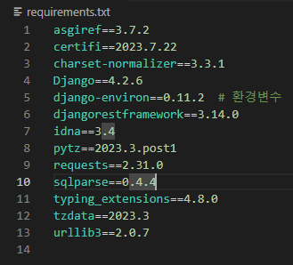
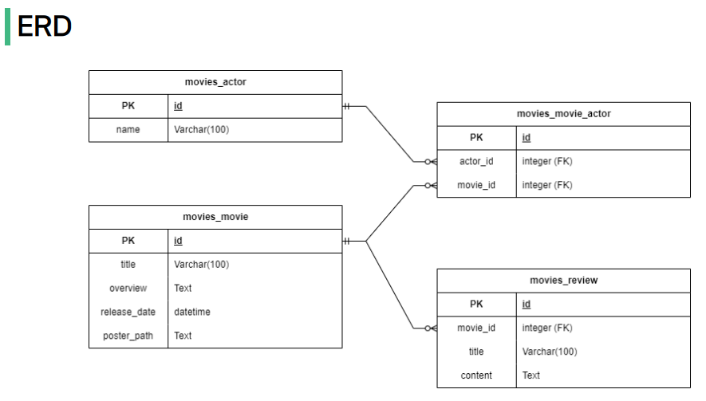
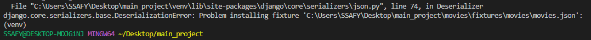
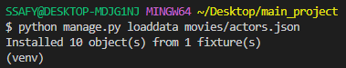
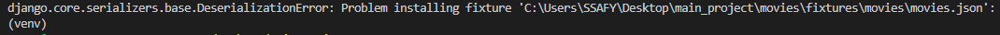
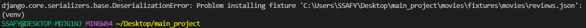
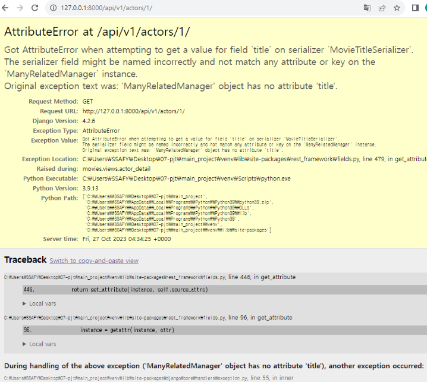
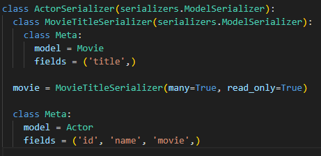
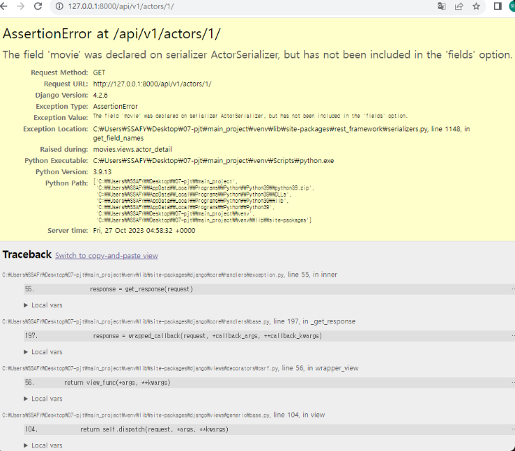
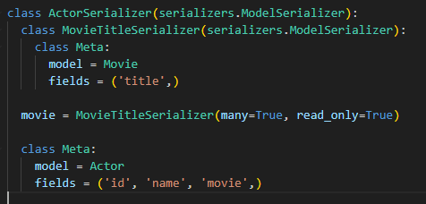

# 07-pjt: 잔잔하고 거친 파도같은 팀(나하나, 엄예진, 이채은)


## New Knowledge from LIVE - 라이브 강의에서 새로 배운 내용

###   
  
1. requirements.txt에 django-environ   
  
  
  
<br>

2. settings.py 설정  
  
```python
# settings.py

# 내 PC 파일안에 저장된 API_KEY 변수를 가져옴  
import environ
import os

env = environ.Env(
    # set casting, default value
    DEBUG=(bool, False)
)

# Take environment variables from .env file
environ.Env.read_env(os.path.join(BASE_DIR, '.env'))  
  
API_KEY = env('API_KEY')
```

<br>

3. 프로젝트 안에 .env 생성  

```
API_KEY="<내 API>"
```

<br>

4. .gitignore  
  
gitignore 파일안에 .env 저장


<br>

## About Project - 프로젝트에 대해서  

  
### Aim of Project - 프로젝트 목표  
  
1. DRF(Django Rest Framework)를 활용한 API Server 제작  
2. Many to one relationship(N:1)에 대한 이해  
3. Many to many relationship(N:M)에 대한 이해  
  

<br>
<br>


### 개발도구  
- Visual Studio Code  
- Google Chrome  
- Django 4.2.x  
- Postman


<br>
<br>


### URL과 HTTP requests methods 설계  
  
| **URL**           | **GET**                            | **POST**         | **PUT**           | **DELETE**        |
|-------------------|------------------------------------|------------------|-------------------|-------------------|
| actors/           | 전체배우목록 조회                  |                  |                   |                   |
| actors/1/         | 단일배우정보 조회(+영화제목)       |                  |                   |                   |
| movies/           | 전체영화목록 조회                  |                  |                   |                   |
| movies/1/         | 단일영화정보 조회(+배우이름, 리뷰) |                  |                   |                   |
| reviews/          | 전체리뷰목록 조회                  |                  |                   |                   |
| reviews/1/        | 단일리뷰정보 조회                  |                  | 단일리뷰정보 수정 | 단일리뷰정보 삭제 |
| movies/1/reviews/ |                                    | 새로운 리뷰 생성 |                   |                   |


<br>
<br>  
  

### ERD (Entity Relationship Diagram)  
  


<br> 

### 일정표  

1. 나하나  
- actor_list 예상: 30분 / 소요: 20분 / 시간: 13:15 ~ 13:35
- actor_detail 예상: 40분 / 소요: 7분 / 시간: 13:35 ~ 13:42

2. 엄예진  
- movie_list  예상: 30분 / 소요: 25분 / 시간: 13:15 ~ 13:40 
- movie_detail  예상: 40분 / 소요: 2분 / 시간: 13:45 ~ 13:47  
- loaddata error 수정  예상: 20분 / 소요: 15분 / 시간: 13:00 ~ 13:15
- merge 후 코드 완성   예상: 40분 / 소요: 13분 / 시간: 13:00 ~ 13:15

3. 이채은  
- review_list 예상: 20분 / 소요: 5분 / 시간: 14:00 ~ 14:05
- review_detail 예상: 30분 / 소요: 40분 / 시간: 14:10 ~ 14:50
- review_create 예상: 10분 / 소요: 10분 / 시간: 15:00 ~ 15:10

<br> 

## Problems from Project - 프로젝트하면서 발생한 문제

### loaddata 에러 no.1 

<br>

  

<br>
  
1. 어떤 loaddata가 에러가 나는지 확인  
  - actors.json은 정상 작동

  <br>

    

  <br>
  <br>
    
  - movies.json에서 에러 발생  

  <br>

    

  <br>
  <br>
  
2. 오타 확인  
  - loaddata하는 과정에서 오타 없음  

3. model 확인  
  - Movie의 models.py를 확인 해 본 결과 주어진 movies.json은 "actors"라는 field가 있었지만 model에 정의하지 않았다.  

    <br>

    

    <br>
    <br>

  
4. 문제 해결  
  - 주어진 ERD를 살펴보니 movie의 actor_id가 actor과 다대다(N:M) 관계를 가져야 하므로 ManyToManyField가 필요하다.  
  
  ```python
  # 기존 코드

  class Movie(models.Model):
    title = models.CharField(max_length=100)  # 영화 제목
    overview = models.TextField()             # 줄거리
    release_date = models.DateTimeField(auto_now=False, auto_now_add=False) # 개봉일
    poster_path = models.TextField()          # 포스터 주소
  ```  

  <br>  

  ```python
  # 수정 후 코드

  class Movie(models.Model):
    title = models.CharField(max_length=100)  # 영화 제목
    overview = models.TextField()             # 줄거리
    release_date = models.DateTimeField(auto_now=False, auto_now_add=False) # 개봉일
    poster_path = models.TextField()          # 포스터 주소
    actors = models.ManyToManyField(Actor, related_name='movie')
  ```  
  
  

### loaddata 에러 no.2  

위와 똑같은 에러가 났다.

1. 어떤 loaddata가 에러가 나는지 확인  
  - reviews.json에서 에러 발생 

  <br>  

  

  <br>
  <br>

2. model 확인  
  - 처음에 movie_id로 외래키 이름을 사용했지만 주어진 reviews.json에는 movie로 되어있다.  
    
  <br>

  

  <br>
  <br>
  
3. 문제 해결  

  - movie_id를 movie로 변경했다.  
    
  ```python
  # 기존 코드

  class Review(models.Model):
    title = models.CharField(max_length=100)  # 리뷰 제목
    content = models.TextField()              # 리뷰 내용
    movie_id = models.ForeignKey(Movie, on_delete=models.CASCADE)     # 외래키(Movie)
  ```  

  <br>  

  ```python
  # 수정 후 코드

  class Review(models.Model):
    title = models.CharField(max_length=100)  # 리뷰 제목
    content = models.TextField()              # 리뷰 내용
    movie = models.ForeignKey(Movie, on_delete=models.CASCADE)     # 외래키(Movie)
  ```  
  

### 서로 다른 출력 형식 serializer
  
전체 영화 목록은 titiel과 overview를 포함시키고 상세 영화 목록은 id, actors, title, overview, release_date, poster_path를 포함해야한다. 

<br>  

```python
# 수정 전 코드
class MovieSerializer(serializers.ModelSerializer):
    class Meta:
        model = Movie
        fields = '__all__'
```  
  
<br>  

수정 전 코드로는 조건을 만족하지 못하는 문제가 발생했다.  
  
1. 방법: 한개의 Serializer 사용하기  
  
  - to_representation 메서드 오버라이드를 사용하여 조건에 따라 필드를 동적으로 조절한다.  
  

2. 방법: 두개의 Serializer 사용하기  
  
  - 전체 목록은 MovieListSerializer을 사용하고 상세 목록은 MovieSerializer를 사용한다.
  
  <br>  

  ```python
  class MovieListSerializer(serializers.ModelSerializer):
      class Meta:
          model = Movie
          fields = ('title', 'overview',)


  class MovieSerializer(serializers.ModelSerializer):
      class Meta:
          model = Movie
          fields = '__all__'
  ```    
    
@ 깔끔한 구조를 위해 두가지 다른 serializer를 사용하는 것이 종종 더 간단하고 관리하기 쉽다고 판단하여 두번째 방법을 사용하였다.

<br>

### serializer fields 관련 에러 no.1

<br>  

  

  <br>

- 단일 actor 상세 정보를 가져올 때, actor가 참여한 movie의 title만 가져와야 했다. 이때 serializers.py에서 ActorSerializer 하위에 MovieTitleSerializer 를 만들고, 아래와 같은 movie 인스턴스를 생성했는데 위와 같은 오류가 발생했다.
```
movie = MovieTitleSerializer(read_only=True)
```
<br>
- 문제 해결 : movie 인스턴스는 다수 데이터를 가진 queryset 형태인데, 이를 serialize화 할 때 many=True를 사용해야 했으나, 이게 빠져서 생긴 오류였다. 따라서 아래와 같이 many=True를 넣어 해결했다.

<br>



<br>

### serializer fields 관련 에러 no.2

<br>



 <br>

- 단일 actor 상세 정보를 가져올 때, id, name, movie_title 순서대로 출력원해서 ActorSerializer의 필드 수정했으나 위와 같은 오류가 발생했다.
```
class Meta:
    model = Actor
    fields = '__all__'
```

<br>
- 문제 해결 : fields를 all로 설정하거나, name만 작성해서 발생한 오류다. 필요한 fields만 아래와 같이 작성해서 해결했다.
<br>




## 프로젝트 소감

<엄예진><br>
세명이 git을 함께 협업하여 사용한 것은 처음이였는데 걱정보다 큰 문제는 발생하지 않았다.<br>
각자 다른 앱을 맡아 작업했던 저번 프로젝트와 달리 이번엔 같은 파일에서 작업해야해서<br>
충돌 발생에 대해 최대한 신경써서 작업했다. <br>
또한, merge시 어떤 부분을 기준으로 합칠 지 상대방의 코드를 자세히 보고 이해하며 진행하였더니<br>
프로젝트에 대한 이해도가 더욱 높아졌다.<br>

데이터베이스와 ERD를 상세히 파악하는 것이 중요하다는 것을 깨달았다.<br>
데이터의 구조, 관계, 테이블, 엔터티 등을 상세히 파악하는 것의 중요성을 깨달았으며, <br>
특히 외래키 생성 시 field명에 id가 자동적으로 붙는 성질을 알고 있어야 했다.<br>

지금은 명세가 작성되어 있어 요청을 이해 후  serializer를 통해 데이터를 직렬화하여 보내주었는데, <br>직점 명세를 작성하게 되면
요청 방식과 경로, 요청 매개변수, 응답 형식, 에러 처리, 예제 요청 및 응답에 대해 
고민하고 작업해야겠다고 생각했다.<br>
<br>
<hr>
<br>
<나하나><br>
처음 REST API Server 설계에 대해 배울 때는, serializer와 views함수 부분에서 이해가 안되는 부분이 많았다. 그런데 오늘 다시 이론을 확인하고 직접 설계해보고 나니, 코드의 논리가 한눈에 보이는 경험을 하게 되어 신기했다.
<br>

그리고 헷갈리는 점들을 팀원들의 도움을 받아 해결하고, 함께 고민한 덕분에 더 빠르게 구현이 가능했던 것 같다. 오늘처럼 체계적이고 효율적으로 코딩을 진행한 경험은 처음이었는데 팀원들과의 소통, 역할 분담, 시간 관리가 중요하다는 것을 깨달았다.
<br>

또한 그냥 단순히 오류를 해결하면 그냥 넘어가지 않고 왜 오류가 발생했는지, 그 오류를 어떻게 해결했는지 ReadMe에 글로 직접 작성함으로써 기억하고 넘어가는 과정이 필수적인 과정임을 느꼈다. 오류해결경험이 장기적인 기억으로 남을 수 있도록 앞으로도 꼭 기록해 놔야겠다.
<br>

또한 세 명이서 git branch를 관리한 경험이 처음이었다. 세 명이라 큰일날수도 있다는 마음에 branch를 merge하고 pull, push하는 과정이 엉키지 않도록 소통하며 신경써서 관리했더니 다행히 문제가 발생하지 않았다. 그리고 신경써서 관리한 덕분에 git branch, commit, merge, pull, push 과정과 방법이 익숙해진것 같고 merge하는 과정에서 필요한 코드를 선택하고 삭제하는 과정이 재밌게 느껴지기도 했다.<br>
<br>
<hr>
<br>
<이채은><br>  
git branch를 사용하면서 항상 branch 이름을 무작위로 설정했는데 저번 관통 프로젝트때 교수님께서 branch 이름도 어떤 작업을 했는지를 알 수 있는 branch 이름이 좋다고 하셔서 팀원들과 함께 작업하고 있는 내용을 branch 이름으로 사용하였다. git branch를 사용하면서 아직까지 터지진 않았지만 🤯 오히려 더 불안한거 같다. 다음에는 master branch에 바로 병합하지 않고 중간 단계에서 병합 후에 할 수 있는 feature branch를 만들어서 git branch를 사용하고 싶다. feature branch를 사용하면 여러 개발자가 동시에 다양한 기능이나 수정사항을 작업할 때 코드 충돌을 최소화하고, 코드의 품질을 유지하는데 이점이 있다.<br>
<br>  
3명이기 때문에 처음에 하나언니와 예진이가 각각 actor, movie를 맡아서 했는데 그동안 나는 README를 작성하면서 navigator 역할을 해주었다. 에러가 생기면 같이 보고 같이 문제를 해결할 수 있도록 도와주고 문제 해결이나 코드 작성에 걸리는 시간을 체크해주면서 팀원들에게 도움이 되고자 했다. 팀원들에게 큰 도움이 되었을지는 모르겠지만 코드 작성을 안한다고해서 할 일이 없고 못 도와주는게 아니라는 것을 알게 되었고 이 역할이 생각보다 중요한 것 같았다. 정말 좋은 경험이었다.<br>
<br>  
처음부터 loaddata가 되지 않아 이 에러를 해결하는데 30분 정도 소요됐다. 세삼 느낀거지만 ERD (Entity Relationship Diagram)를 잘 보는게 중요하고 반대로 생각하면 최종 프로젝트 때 ERD를 설계하는게 정말 중요할 것 같다. 그리고... Commit을 더 작성해야 한다!!!!<br>
<br>  
이렇게 좋은 팀원들과 관통 프로젝트를 끝까지 같이 할 생각에 벌써 설렌다. 우리 부디 싸우지 않고 오순도순 잘 해봅시다. ✨