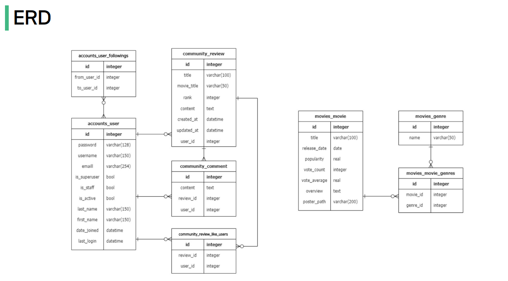

# 08-pjt: 곧 터질 것 같은 시한폭탄 팀(나하나, 엄예진, 이채은)

## About Project 

  
### Aim of Project
  
1. 데이터를 생성, 조회, 수정, 삭제할 수 있는 Web Application 제작
2. AJAX 통신과 JSON 구조에 대한 이해
3. Many to one relationship(N:1)에 대한 이해
4. Many to many relationship(N:M)에 대한 이해
5. 영화 추천 알고리즘 설계
  

 
 

### 개발도구  
- Visual Studio Code  
- Google Chrome  
- Django 4.2.x  

 
 

### ERD (Entity Relationship Diagram)  
  

 
   
  

### 명세서

#### 유저 팔로우 기능

1. 프로필 페이지에 팔로워 수와 팔로잉 수를 표시합니다.
2. 프로필 페이지에 해당 사용자를 팔로우 할 수 있는 버튼을 표시합니다.
3. 인증된 사용자만 다른 사용자를 팔로우 할 수 있으며,
사용자는 자기 자신을 팔로우 할 수 없습니다.
4. 팔로우 버튼을 클릭하는 경우, AJAX 통신을 이용하여 서버에서
JSON 데이터를 받아와 상황에 맞게 HTML 화면을 구성합니다.

 
 
#### 리뷰 좋아요 기능  

1. 전체 리뷰 목록 조회 페이지에 좋아요 버튼과 좋아요 개수를 표시합니다.
2. 이미 좋아요 버튼을 누른 경우 좋아요 취소 버튼을 표시합니다.
3. 인증된 사용자만 리뷰에 좋아요 할 수 있습니다.
4. 좋아요 버튼을 클릭하는 경우, AJAX 통신을 이용하여 서버에서
JSON 데이터를 받아와 상황에 맞게 HTML 화면을 구성합니다.

 
 
#### Movies 앱 기능

1. 전체 영화 목록 조회 (index)
- 사용자의 인증 여부와 관계없이 전체 영화 목록 조회 페이지에서 적절한 UI를
활용하여 영화 목록을 제공합니다. (사용자에게 제공할 HTML은 index.html)
2. 단일 영화 상세 조회 (detail)
- 사용자의 인증 여부와 관계없이 단일 영화 상세 조회 페이지에서 적절한 UI를
활용하여 영화 정보를 제공합니다. (사용자에게 제공할 HTML은 detail.html)

 
 
#### 영화 추천 기능

1. 사용자의 인증 여부와 관계없이 단일 영화 상세 조회 페이지에서 적절한 UI를
활용하여 영화 정보를 제공합니다.
(사용자에게 제공할 HTML은 detail.html)
2. 영화를 추천하는 알고리즘은 자유롭게 구상합니다.
3. 구현한 알고리즘에 대한 설명은 README.md 에 상세히 작성합니다.

 
 
#### 댓글 좋아요 및 대댓글 기능

1. 단일 리뷰 상세 조회 페이지에
댓글 좋아요 버튼과 좋아요 개수를 표시합니다.
2. 각 댓글에 하위 댓글을 작성할 수 있는
대댓글 기능을 완성합니다.

 
   
  

### 일정표  

            
| plan time     | responsibility | role                                       | completed time | is on_time?  | importance |
|---------------|----------------|--------------------------------------------|----------------|--------------|------------|
| 11:00 ~ 12:00 | 하나, 예진, 채은     | 일정 작성                                      | 11:00 ~ 11:50  | Yes          | -          |
| 12:00 ~ 13:00 | 하나, 예진, 채은     | 점심 시간                                      | 12:00 ~ 13:00  | Yes          | -          |
| 13:00 ~ 13:30 | 채은             | 리뷰 좋아요 기능: like function                   | 13:00 ~ 13:16  | Yes(earlier) | highest    |
| 13:00 ~ 13:40 | 예진             | 유저 팔로우 기능: follow function                 | 13:00 ~ 13:30  | Yes          | highest    |
| 13:40~14:00   | 예진             | Movies 앱 기능: 전체 영화 목록 조회(index) function   | 13:30 ~ 13:33  | Yes(earlier) | high       |
| 13:40~14:10   | 하나             | 유저 팔로우 기능: AJAX 사용하여 HTML 화면 구성            | 13:40~15:02    | No           | highest    |
| 13:40~14:20   | 채은             | 댓글 좋아요 및 대댓글: comment function             | 13:20~13:45    | Yes          | low        |
| 14:10~14:30   | 예진             | Movies 앱 기능: 단일 영화 목록 조회(detail) function  | 13:33 ~ 13:35  | Yes(earlier) | high       |
| 15:10~15:30   | 하나 -> 예진       | Movies 앱 기능: 전체 영화 목록 조회(index) HTML 추가 기능 | 15:10~15:25    | Yes          | low        |
| 15:40~16:00   | 하나 -> 채은       | Movies 앱 기능: 단일 영화 목록 조회(detail) HTML      | 15:10~15:40    | No          | low        |
| 14:20~15:00   | 하나             | 리뷰 좋아요 기능: AJAX 사용하여 HTML 화면 구성            | 16:20~16:40    | No              | highest    |
| 16:20~16:40   | 하나 -> 예진       | 영화 추천 알고리즘: detail.html 수정                 | 15:20~16:20    |              | low        |
| 15:50~16:40   | 채은, 예진         | 댓글 좋아요 및 대댓글: AJAX 사용하여 HTML               |                |              | low        |
| 16:40~17:00   | 하나, 예진, 채은     | README 작성                                  | 16:40~17:00    | Yes          | -          |

 
 

   
 
  
### 일정 체크업

유저 팔로우 기능: AJAX 사용하여 HTML 화면 구성이 지연된 이유는 base.html에 을 작성 하지 않았기 때문에 팔로우 버튼이 작동되지 않았다. 이 지연으로 인해 나머지 frotend 부분이 모두 지연되었다.   
  
 
  
리뷰 좋아요 기능: AJAX 사용하여 HTML 화면 구성이 지연된 이유는 views.py와 script태그 간 연결을 고민했다.  
  
 
  
Movies 앱 기능: 단일 영화 목록 조회(detail) HTML이 지연된 이유는 git이 꼬여서 무리하게 pull, push를 반복하다 포기하고 다시 clone을 받았다.  
   
 
   
Movies 앱 기능: 전체 영화 목록 조회(index) function과 Movies 앱 기능: 단일 영화 목록 조회(detail) function를 예상시간 보다 약 1시간 정도 빠르게 완료했다. 다음에 관련 함수를 작성할 때 시간을 더 줄여야 겠다.

  
 

## 프로젝트 소감

<엄예진> 
세명이서 진행되는 것에 익숙해지고 있다.   
각자 잘할 수 있는 부분을 맡아 진행하고 합치니 일이 빨리 진행되었다.  
하지만, 중간에 파트너의 일을 넘겨받게 되었을때, 시간분배에서 약간의 이슈가 발생하였다.  
추가 일 발생에서 시간 분배 시 기준이 일의 양도 중요하지만, 체력도 중요하다는 것을 깨달았다.  
일의 양에 따라서만 시간 분배를 진행하여 이후 누적된 피로도를 이기지 못해  
집중도가 떨어지는 이슈가 발생하였다.  
중간 쉬는 시간 분배가 중요하다는 것도 이에 해당되는 이슈인 것 같다.  
 

 

<나하나> 

좋아요와 팔로우 기능의 html 부분을 구현하는 frontend 부분을 담당했다. script태그 작성 부분이 익숙하지 않아 쉽지 않은 하루였다.
그동안 실습은 단순히 한개의 html 파일에서만 했었기에, base 템플릿이 있는 환경을 고려하지 못했다. 그래서 base에 block script태그를 달아야 한다는 것을 생각하지 못했다. 이로 인해 디버깅하느라 시간이 많이 지연되었다. 오류가 없는 다른 부분에서 오류를 찾고 있었다..
그리고 좋아요 script를 구현할 때는 좋아요 클릭시 좋아요 갯수가 업데이트 되지 않는 이슈가 있었다. 원인을 찾아보니, 좋아요 태그의 게시글 넘버를 변화를 시켜주지 않았음을 알았다. django 환경에서 script 작성하는 연습을 열심히 해야겠다고 느낀 하루였다.
 
오늘 머리터지게 고민해본 경험 덕분에 다음 번엔 예정한 일정시간 안에 맞출 수 있을 것 같다고 생각한다..

 

 

<이채은>   

오늘 주요 목표가 JavaScript여서 skeleton 코드로 생각보다 view 함수를 쉽게 작성했다. 빨리하고 하나 언니 몫을 도와주려 예진이와 분담을 했다. 급하게 하려고 해서인지 한 번도 꼬이지 않던 git도 꼬여버려서 그냥 git pull, git push를 계속 입력했으나 도저히 아무것도 되지 않아서 파일을 삭제하고 다시 git clone을 받았다. 다행이도 새로운 브랜치에서 작성하고 있던 코드가 하나도 없어서 다행이었지만 만약에 진행되고 있던 코드가 많았다면.. 생각만해도 끔찍하다. 다시 생각해보니 git merge와 git pull을 계속 잊고 진행 했거나 브랜치를 이동해야하는데 이동하지 않아서 오류가 났었던 것 같다. 다음에는 이런 실수를 최대한 줄여보고 파일 삭제를 해서 해결하지 않고
스스로 해결해보고 싶다.  
하나 언니가 <리뷰 좋아요 기능: AJAX 사용하여 HTML 화면 구성> 이 부분을 진행하고 있을 때 내가 작성한 like function이 html을 작성할 때 잘 작동하지 않고 언니가 다시 수정을 해서 html을 만들었다. front가 back이 작성한 함수를 토대로 진행을 해야하는데 내가 필요한 변수 이름이 아닌 다른 이름을 사용해서 언니가 작업을 끝내는데 지연이 되었다. 다음에는 함수 작성할 때 frontend가 원하는 방향대로 작성을 해야겠다고 생각했다.  
오늘은 짧은 시간안에 해야할 일이 많아서 정신도 없었고 원하는 방향대로 잘 진행이 되지 못해서 아쉬웠다. 하지만 오늘 일을 토대로 관통 프로젝트를 할 때에는 더욱
완벽하게 진행이 되었으면 좋겠다.