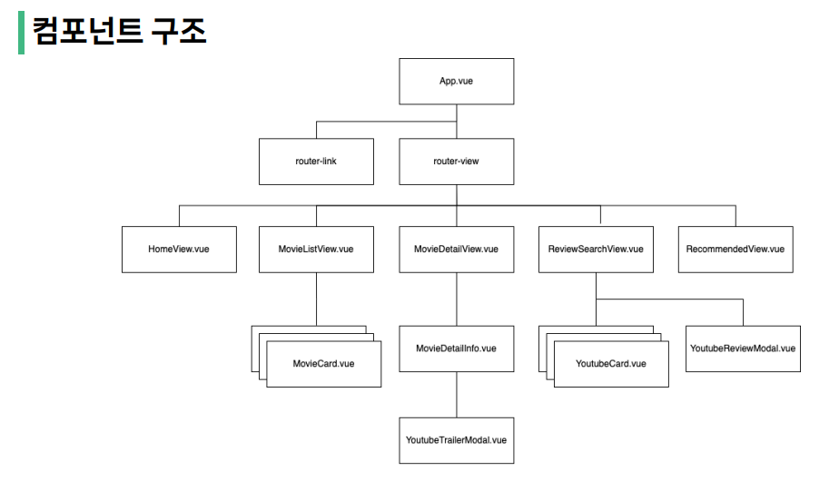
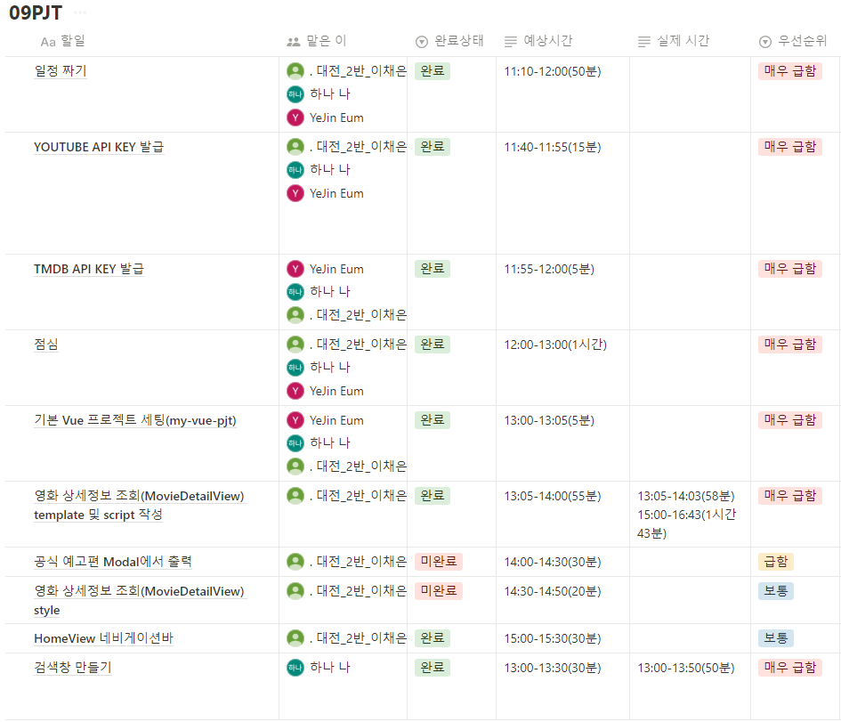
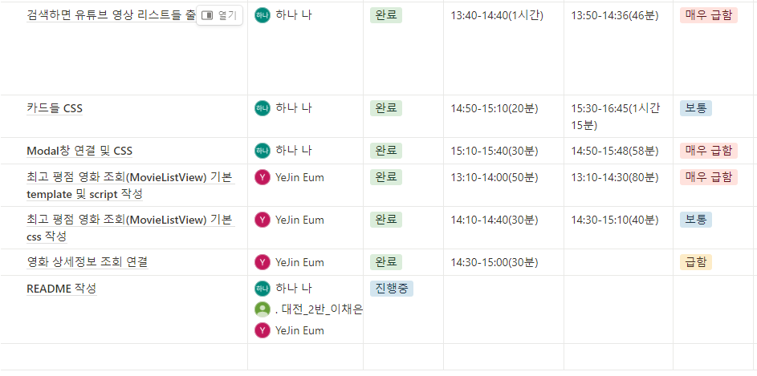

# 09-pjt: 엉망진창 지끈지끈 팀(나하나, 엄예진, 이채은)


## New Knowledge from LIVE - 라이브 강의에서 새로 배운 내용

###

[TMDB TOP RATED](https://developer.themoviedb.org/reference/movie-top-rated-list)
공식문서를 활용하고 LANGUAGE에서 JavaScript를 클릭후 기본 세팅에는 FETCH로 되어있으므로 Axios로 바꾼 후 Try It!을 클릭해서 200 Response가 나오면 사용 가능하다.

###   

1. settings.py 설정  
  
```python 
axios.get(`https://api.themoviedb.org/3/movie/${movieId}?api_key=${import.meta.env.VITE_TMDB_API_KEY}`
```

<br>

2. 프로젝트 안에 .env 생성  

```
API_KEY="<내 API>"
```

<br>

3. .gitignore  
  
gitignore 파일안에 .env 저장


<br>

## About Project - 프로젝트에 대해서  

  
### Aim of Project - 프로젝트 목표  
  
1. 영화 정보를 제공하는 SPA 제작  
2. AJAX 통신과 JSON 구조에 대한 이해
3. Vite, Vue Router 활용 
  

<br>
<br>


### 개발도구  
- Visual Studio Code  
- Google Chrome  
- Node.js LTS
- Vue.js 3.x


### 사용 API 
- TMDB API 
- Youtube API 
- OpenWeather API (도전 과제)

<br>
<br>

  
### ERD (Entity Relationship Diagram)  
  


<br> 

### 일정표  




<br> 

## 일정대로 진행되었는지
### 지연된 이유
- http와 https는 다르기 때문에 http로하면 400 BAD가 뜬다.
- postman 사용 시 body에 기존 데이터가 남아있는 경우 400 BAD 발생 
- 물만두를 40개나 먹어도 된다는 점
- 영화 상세정보는 영화 조회에서 합칠때 에러가 많이 발생해서 여유롭게 했어야 했다.
- 검색창에 검색하면, 유튜브에서 검색이 되어 출력되도록 연결하는 부분 (encodeURIComponent 라는 검색어 인코딩 방법..)
- iframe이라는 것을 사용해서 유튜브 영상화면을 띄우는 방법을 배웠다. (api랑 iframe 태그만 있으면 사용 가능)
- 카드 CSS 대신 Home 화면 nav CSS 작업으로 대체
- API를 가지고 올때, 어떤 방식으로 가지고 올지 선택해야함
- 연결 시간 따로 필요

## 프로젝트 소감

<엄예진><br>
조퇴.
<br>
<hr>
<br>
<나하나>
<br>

- 학습한 내용: 외부 API를 가져와서 적용하는 법을 배웠습니다. JSON.parse함수를 사용하는 법을 배웠습니다.
- 어려웠던 부분: 검색창에 검색하면, 유튜브에서 검색이 되어 출력되도록 연결하는 부분 (encodeURIComponent 라는 검색어 인코딩 방법..)
- 새로 배운 것들: iframe이라는 것을 사용해서 유튜브 영상화면을 띄우는 방법을 배웠다. (api랑 iframe 태그만 있으면 사용 가능) http와 https는 다르기 때문에 http로하면 400 BAD가 뜬다는 것을 배웠다. 그리고 postman 사용 시 body에 기존 데이터가 남아있는 경우 400 BAD 발생한다는 것을 배웠다.
- 느낀점: 실제 API를 가져와서 화면 상에 구현하는 경험이 거의 처음이어서 쉽지 않았던 것 같습니다. 그래도 코드를 치면 직접 눈으로 보이는게 신기하고 재밌었습니다. 여러 컴포넌트들과 연결관계를 갖고 있고 url이 존재한다는 점 등이 Django와 유사해서 신기했습니다.<br>
<br>
<hr>
<br>
<이채은><br>  
일정표를 짤때 이번에는 노션을 사용했다. 이게 훨씬 간편하고 사용하기 쉬워서 실제 관통 프로젝트 할때에도 사용할거 같다.<br>
<br>  
3명이기 때문에 순조롭게 진행될 줄 알았지만 API키를 받고 그걸 사용하는게 너무 어려워서 시간이 오래걸렸다. 내가 할 일이 바빠서 예진이를 도와주지 못해 사실상 모든게 지연되어 버렸다. 다음에는 팀원 먼저 도와주는게 더 좋을 거 같다.<br>

<br>  
마지막만 잘하면 됩니다!!. ✨